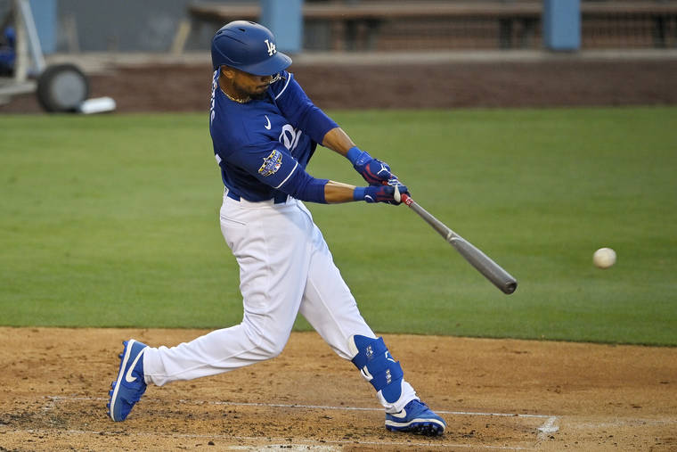

## Why Hitting?

At the core of every project, you gotta make sure you have the basics. Before we had advanced statistics like launch angle, rotational velocity, exit velocity, etc., we had basic hitting stats. When trying to predict whether a player will get a hit in a given MLB game, the most obvious statistic that could potentially be an indicator of the next game is their hitting success history. 

Batting stats include batting average, which is simply a player's hits divided by his total at-bats (a number between .0 and 1.00). Although it is widely known to be a "probability metric" or the greatest indicator of a player's value, it may not be the greatest indicator of a player getting a hit. The highest batting averages are in the upper .300 range and, well, we're trying to do a bit better than 30% accuracy. However, it could still be useful because we definitely know that a player with a high batting average compared to a player with a low batting average is more likely to get a hit on any given day, and that is always true. 

Other metrics on the batting side that we extracted for this project include OBP (On Base Percentage), SLG (Slugging), OPS (on base plus slugging), contact percentage (the ratio of balls hit into play/total number of at-bats), and batting average per ball hit into play. These metrics by themselves could be exteremely valuable, and hopefully when added together can be even more predictive. 

Variables were aggregated on a game-by-game basis for each season the player played. We also calculated 10, 20, and 30 day window averages to account for potential "streaky" behavior. 

## Methodology and Sources

We were able to obtain batting metrics from a free API found on Github called [pybaseball](https://github.com/jldbc/pybaseball). For a given player and date range, the API returned pitch-by-pitch data pulled from [Baseball Savant](https://baseballsavant.mlb.com/csv-docs). Hundreds of metrics were returned including pitch type, game date, launch angle, pitcher information, and [more](https://baseballsavant.mlb.com/csv-docs). We calculated about 63 data points including hitter aggregated stats and game logs, next game hitter versus starting pitcher stats, and hitter window aggregated stats (to account for possible streakiness behavior). 
