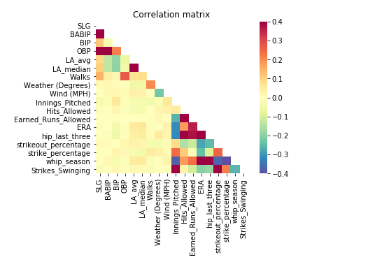
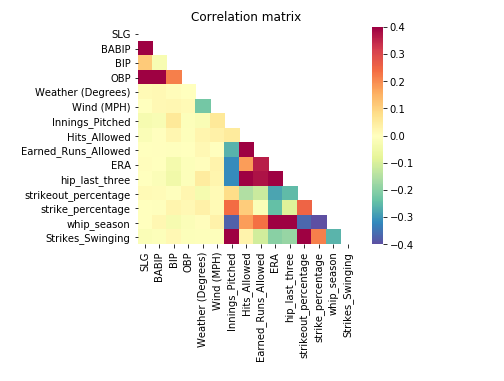
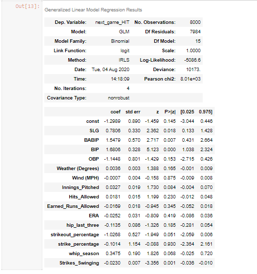

**[<-PREVIOUS PAGE]({{page.previous_}} "previous")** **[NEXT PAGE ->]({{page.next_}} "next")**   
Our previous model established a core set of base variables that will serve as the foundation of all other variables to be added. We will now look to seek out and find more variables that can help improve the model. We will also explore whether adjusting the parameters of the model itself will make a difference, these adjustments include adding a L1 (Lasso) and L2 (Ridge) penalty to our generalized linear model.

We first start by going back to the drawing board of variable selection and feature engineering. I went over the list of variables and consulted with my teammates about additional variables to add to our model. I set out to understand why these variables would contribute to better model performance. **hip_last_three**, which describes hits allowed per innings pitched in the last three games, as well as **strikeout_percentage** which illustrates the ratio of strikeouts to all other outcomes on the season, are intuitively very important. This new set of variables would give a better insight to the response variables (projecting a hit) by further including some pitching variables of interest. 

The correlation map above demonstrates that all these variables in some way or another are strung together; strikeout percentage is strongly correlated with strikes_swinging, which in turn corresponds to a lower ERA, etc. This string of correlatory behavior make our new variables qualified to include in the model as well. Further tinkering our variables to omit **walks** and **launch angle** stats gives us a very solid set of variables that we can now train our model on:

With these new variables inserted into our explanatory variable section of our model, it was now time to put our general linear model to the test. After running this model with a signficantly bigger dataset of the original data, we see that it yields a .682 precision score, a .082 increase from our original model. These results show that our newly inserted variables made huge dividends in the general linear model's performance. 

Can we improve the model's performance by tuning the parameters? With a basic generalized linear model being quite impressive, it was now time to look for alternative linear models that might have a better performance. With this in mind, I inserted a L1 norm penalty to our linear model, to see if adding a penalty of the model's cost function would cause more outside noise of the variables to be eradicated and thus have a better model performance. After inserting this alternative, we see that the model performs a tad worse than our original base linear model, which can probably be explained by the strong correlation of the variables and lack of outside noise, putting us in a matter of overfitting the model to our data. Here is the code that performs and evaluates the L1 regularization:

        from sklearn.linear_model import LogisticRegression

        log_reg = LogisticRegression(penalty = 'l1', solver = 'liblinear')
        clf = log_reg.fit(X_train, y_train)

        pred = clf.predict(X_test)
        precision_score(y_test,pred)

To confirm this hypothesis, I added a similar but different alternative model, the L2 norm penalty which acts as a penalty that corresponds more with the amount of variables in the model than the cost function of the model. This penalty yielded even worse resuls than our previous two models (67%).

Since both penalties decreased our model's performance, it is evident that our variables we chose were very solid. Looking at the metrics of this linear model, we see that almost all the variables have a very small P>lzl value. This means that these variables are significant to the response variable in the model (the outcome of being a hit or not a hit) which means they all play a signficant role in finding out rather a player will get a hit or not against another player on a given day. Progress indeed.  

  
**[<-PREVIOUS PAGE]({{page.previous_}} "previous")** **[NEXT PAGE ->]({{page.next_}} "next")** 