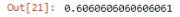

**[<-PREVIOUS PAGE]({{page.previous_}} "previous")** **[NEXT PAGE ->]({{page.next_}} "next")**   
From the last blog we got a good look at the variable selection for our model given each variables to correlation with other variables of connection to our response variable of rather or not a player will get a hit at his next at bat.

We may need to go back to our feature engineering portion later, but right now lets see how this group of variables will do in a model. The first model I wanted to try out is the Logistic Regression model, the logistic regression model presents an fundamental understanding in terms of how it determines its statistical inferences with the given variables, given its fundamental operational process, we can step back and see from a basic level how the variables will do in our models.

We fit the explanatory variables in with the response variables and then split the dataset up by date (that way our training dataset reflects data of the past and not the future)

Prepping the dataset for its model and fit the training data into the model.

After finding the precision rate of the model, we see that right now our model accuracy is about 60%, which in a sense is not bad considering a preliminary status. There is a vast multitude of things to still uncover, such as rather this model and be modeled into an optimal form or possibly even overfilling the data ultimately making it worse. All I know wherever it takes us, it’ll be one wild ride :*

   
**[<-PREVIOUS PAGE]({{page.previous_}} "previous")** **[NEXT PAGE ->]({{page.next_}} "next")**   