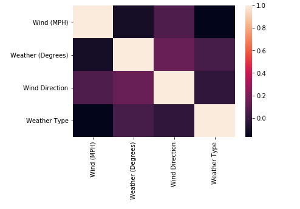
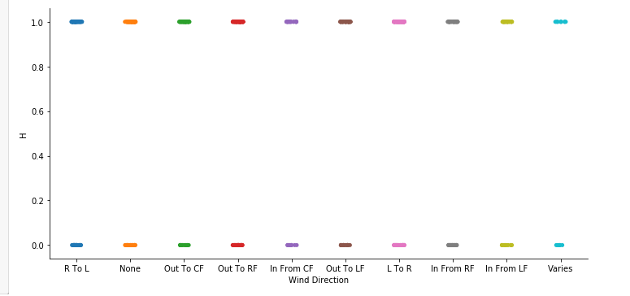
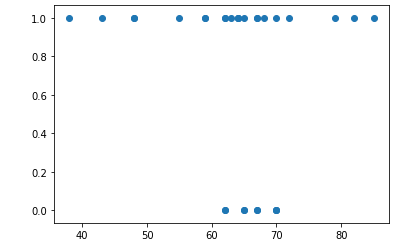
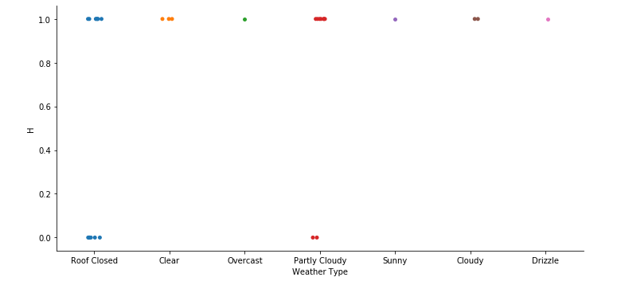
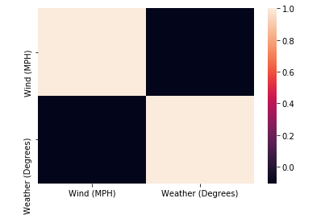
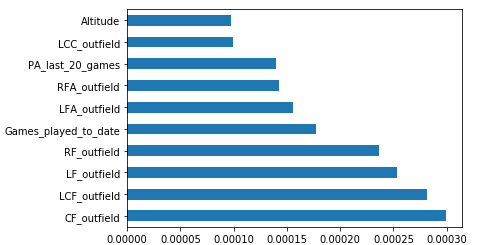
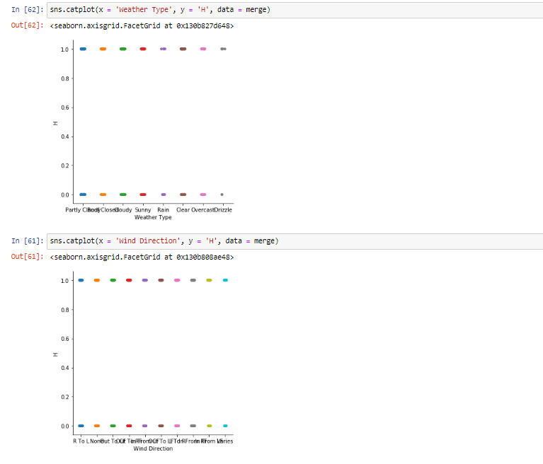

One category of variables that we considered using for our model was weather and wind data.
This data was scraped directly from mlb.com and the four variables we scraped were the
weather in degrees, the weather type, the wind speed in miles per hour, and the wind direction.
The web scraping was done in BeautifulSoup4 and Selenium. We traversed through each day
between the 2014-2019 seasons and scraped the box score, venue, and weather and wind data
for each season game.

Data on MLB website:

The rationale behind using these variables is that it might be easier or harder to get a hit during
different weather and wind conditions. For example, a player may be more physically drained
and thus have a more difficult time getting a hit if the weather is sunny and over 90 degrees. On
the contrary, a player may have an easier time getting a hit if the wind is strong and blowing
toward the outfield as it favors the batter.

In order to find out whether weather and wind data correlated with a player getting a hit, we
matched the weather data with game logs and ran some statistical tests. For the continuous
variables such as weather (degrees) and wind speed (mph), we first tried running logistic
regression. However, there was almost no linear correlation for either variable or combined to
be found with very small r2 values close to 0.

Weather (Degrees): 

Wind Speed (MPH):

Combined:

Similarly, the scatterplots that we created for the variables did not provide much insight:

Weather (Degrees):

Wind (MPH):

When we created categorical plots for the categorical values of weather type and wind direction, we again received little insight regarding the general dataset.

Weather Type:

Wind Direction:

We then looked at player-specific data where we looked at individual players to see if there was a larger correlation there since all players have different behaviors. We received similar results with very low pseudo-rr2 values when running logistic regression. Weather (Degrees) had a pseudo-rr2 value of only .02 while wind speed (MPH) had a slightly higher, but still small, pseudo-rr2 value of .14. Combined, they had a pseudo-r2 value of .16.

Weather (Degrees):

Wind Speed (MPH):

Combined:

However, we noticed more patterns when graphing the variables for individual players, and the scatterplots showed more hints of potential patterns as opposed to the general dataset.

Weather (Degrees): 

Wind Speed (MPH):

Similarly, when we looked at the categorical plots for individual players, we saw more of a correlation between weather types and wind speed and whether the player got a hit, especially weather types. 

Weather Type:

Wind Direction:

Overall, this indicated to us that weather and wind were more prominent factors on an individual basis. At a larger scale, there was significantly less significance and correlation as opposed to certain individual players, suggesting that some players are heavily influenced by weather and wind while others aren’t.

We also observed a correlation heatmap where we didn’t find much correlation between Weather (Degrees) and Wind (MPH).

Correlation Heatmap:

Lastly, we used the general dataset to train three different models: Random Forest (best performing), Logistic Regression, and Linear SVC. Categorical variables were one-hot encoded. The weather and wind data weren’t influential factors in our best performing models both as a whole and individually, adding very little value to the prediction. However, Weather (Degrees) did appear as one of the more influential features in Linear SVC, which was the least accurate model. Below are graphs showcasing the most influential features for each model.

Random Forest:

Logistic Regression:

Most influential features for Linear SVC:

Overall, weather and wind variables were not too impactful in our general model. However, we believe that they can play a large role when looking at player specific models.

