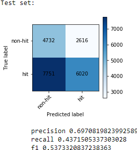
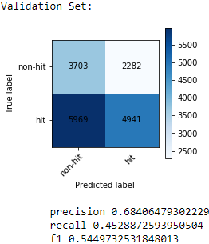
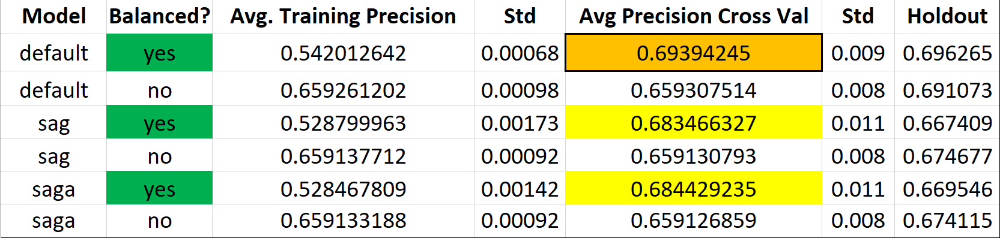
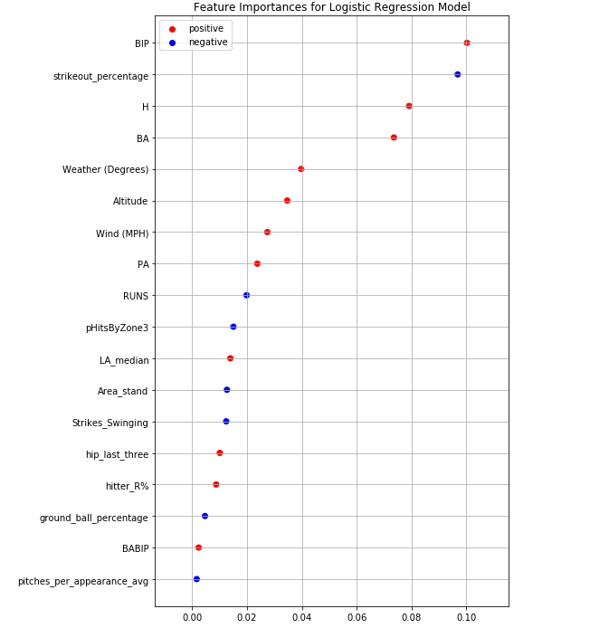

**[<-PREVIOUS PAGE]({{page.previous_}} "previous")** **[NEXT PAGE ->]({{page.next_}} "next")**   

As seen in Nathaniel's previous blog post, he utilized a small subset of core or "base" variables in a logistic regression model. Using Nathaniel's variable selection technique, I was able to obtain a similar set of variables. In addition to the variables he selected, I chose to include 'H', a ballpark measure of how much a stadium favors hitting (above 1 is favorable, below 1 is not). I altered some of his original variables to account for recent history as opposed to the whole season. For example, I replaced "hits per innings pitched on the season" with "hits per innings pitched the last three games". Below are the following variables I selected: 

    predictor_vars = ["PA_last_10_games","BA","pHitsByZone3","hitter_R%", "BIP", "BABIP", "LA_median", "Weather (Degrees)", "Wind (MPH)", "Area_stand", "Altitude", "H", "RUNS", "pitches_per_appearance_avg", "strikeout_percentage", "hip_last_three", "ground_ball_percentage"]

After some preprocessing and scaling using the StandardScaler offered by Scikit-Learn, we can train a logistic regression model using our newly acquired variables.

    from sklearn.linear_model import LogisticRegression
    log_reg = LogisticRegression()
    clf = log_reg.fit(X_train, Y_train)

Using these new variables, we achieved a 65% average precision score using 10-fold cross validation. The standard deviation out of all of our validation scores was 0.00098, meaning that it is fairly robust. BUT there is a slight problem with this approach...

The total percentage of hits to no hits in our dataset was around 65% hits to 35% non-hits. If we guess there to be a hit on every single instance of the dataset, we would be right 65% of the time! This is problematic, especially when dealing with logistic regression because in the training set it can be biased towards the more weighted outcome. The accuracy and F1 score affirm that this isn't really the case, but still it may be better to balance our classes in our training set. We can use a technique called Random Under Sampling, which takes away samples from the higher-frequency class until both classes are even in the training set. 

Using this "balancing" technique on our training set, we actually achieved an even higher accuracy on the test and validation sets: 

We now achieved an even higher precision at around 70 percent on our test set and 68 percent on our validation set. Since both scores are similar, we can be pretty confident that it is unlikely that due to random chance the scores would be this close to each other.

Now, can we optimize our logistic regression model? We can tinker the model's "solver" hyperparameter to try "SAG" and "SAGA" and then compare those with the default Logistic Regression model without any parameters. SAG stands for stochastic average gradient descent and is a variation of gradient descent that uses a random sample of gradient values. SAGA is an extension of this, but allows for L1 regularization. Performing a test of balanced and unbalanced training sets with each of the different logistic regression solvers and using 10-fold cross validation, here are the results:

Across the board, balanced datasets performed way better than unbalanced. When the sets are unbalanced, we often have bias and it makes sense that since the percentage of hits appearing in the dataset is 65% percent to begin with, those models didn't perform any better. With a balanced approach, we achieved a true extra 5 percentage points across the board. The default Logisitic Regression model, which uses a liblinear solver as "default", performed the best on our test and validation sets with an averagge precision score of 69 percent. 

Below is a breakdown of the top variables our model used. It is very interesting to see that BIP, or Batted in play average, is our most important feature. This feature basically explains how often a player makes contact with the ball and puts it into play. It makes complete sense that it has a positive correlation with our response variable, where the higher your contact percentage is, the more likely you are to get a base hit. The pitcher's trikeout percentage on the season is also a high indicator of our response and is our second most important feature. The higher the strikeout percentage is, the more unlikely the player with achieve a base hit.

  
**[<-PREVIOUS PAGE]({{page.previous_}} "previous")** **[NEXT PAGE ->]({{page.next_}} "next")** 