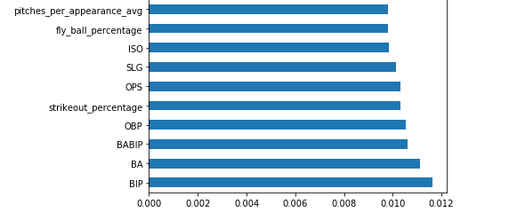
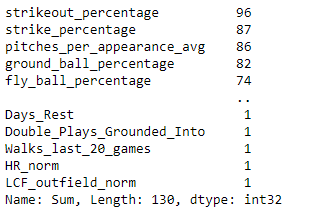
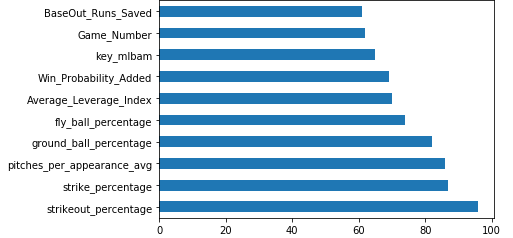

**[<-PREVIOUS PAGE]({{page.previous_}} "previous")** **[NEXT PAGE ->]({{page.next_}} "next")**   

Aside from the general dataset, we also wanted to look at player-specific models. The intuition behind this is that we want to capture the uniqueness of every player instead of generalizing them all together. For example, one player may be heavily affected by weather while another player may not be affected by weather at all. To test if this hypothesis was valid, we trained separate Random Forest models (Random Forest was high-performing and not too time intensive but other models such as Logistic Regression would've worked as well) for each player with more than 30 samples (72% of total players in our original dataset met this criteria) and recorded the most influential features.

One the general dataset, the most influential features for a Random Forest model were BIP, BA, and BABIP.

However, when totaling the number of times a certain feature appeared in the top 3 most influential features for each individual player, the following were the most infleuntial features:

The top 3 features were actually strikeout_percentage, strike_percentage, and pitches_per_appearance_avg, none of which were in the top 3 for the general dataset.

When observing the most influential features for each player, we noticed that they varied significantly from one another, which signified to us that each player is unique and that it is worth looking into player-specific models.

  
**[<-PREVIOUS PAGE]({{page.previous_}} "previous")** **[NEXT PAGE ->]({{page.next_}} "next")** 
