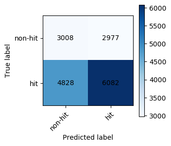
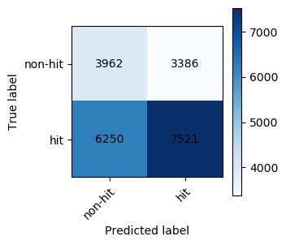

**[<-PREVIOUS PAGE]({{page.previous_}} "previous")** **[NEXT PAGE ->]({{page.next_}} "next")**   

Given the complex nature of our dataset, perhaps a Multi-Layer Perceptron (MLP) could give us even better results. A MLP is a feed-forward neural network that consists of at least three layers of nodes: an input layer, a hidden layer, and an output layer. MLP uses backpropagation for training, which allows us to find more complex, non-linear relationships in the data. Additionally, [Alceo and Henriques (2017)](https://www.insticc.org/Primoris/Resources/PaperPdf.ashx?idPaper=83622 "link to paper") found that their baseball dataset  achieved an 85% top 100 precision score when using a three-layer MLP. We were influenced by their results to take a crack at using a MLP and maybe even perform better.

Our model utilized the same variables as seen in my previous Logistic Regression blog post. I decided to create a model with three layers: an input layer, a hidden layer with the dimension of the nodes reduced by half and activated by the 'relu' function, and an ouput layer reducing the number of nodes to 1 and activated by a sigmoid function (to convert the output between 0 and 1). I also utilized an Adam Optimizer and log loss cost function (binary crossentropy). After fine-tuning the parameters over many iterations, the best results came with a learning rule of 0.001, 512 batch size, and 65 epochs. The following code demontrates my implementation:

        dimen = X_train.shape[1]
        optimizer = tf.keras.optimizers.Adam(lr=0.001)
        model = models.Sequential()

        # number of columns is input dimension
        model.add(layers.Dense(dimen, input_dim = dimen))
        model.add(layers.Dense(dimen/2, activation = 'relu'))
        model.add(layers.Dense(1, activation = 'sigmoid'))

        model.compile(optimizer = optimizer, loss = 'binary_crossentropy', metrics = ["accuracy", tf.keras.metrics.Precision(name = "prec")])

        model.fit(X_train, Y_train, validation_data = (X_test, Y_test), batch_size = 64, epochs =65, callbacks = [checkpointer], verbose = 1)

I also experimented with different variable sets, even more layers, and playing with the hyper-parameters. In a future project, I would like to more comprehensively try my hand at deeper models and finding even better outcomes.

Here is a look at the general results on our training and validation set:

Validation Set:

Precision: **0.6713765316260073**

Test Set:

Precision: **0.6895571651233153**

Since we applied random-under sampling, normalized the data, and split up the testing into two sets, it can be stated that the testing and validation results are fairly robust. Since both scores are around the same (with the test set having a higher score), we can conclude that our deep learning MLP got us a score almost exactly in line with our logistic regression model, if not maybe a little worse. 

  
**[<-PREVIOUS PAGE]({{page.previous_}} "previous")** **[NEXT PAGE ->]({{page.next_}} "next")** 