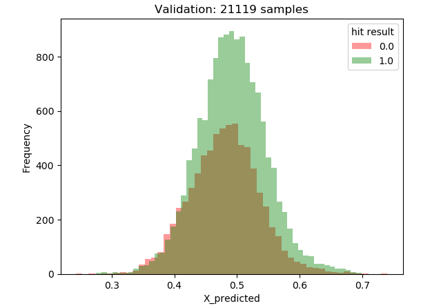
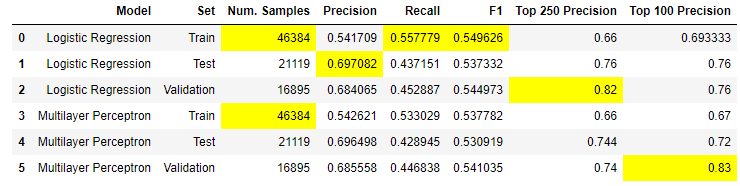

**[<-PREVIOUS PAGE]({{page.previous_}} "previous")** **[NEXT PAGE ->]({{page.next_}} "next")**   

Although we did not achieve an incredibly high average precision score, what if we took the top K predictions offered by each model? How successful are our models' most confident predictions?

In the case of Logistic Regression, we can compute our best model's predictions for our test and validation sets. Since the model predicts a probability value that is then rounded to 1 or 0, let's order the instances in descending order and calculate the precision for the top 250 and 100 values. 

We achieved a similar result of 76% precision on our test set for those top 100 predicted values as well. These are pretty good results, given that in the best case scenario, 82 out of 100 predictions will be correct! Below is the distribution of predictions and its predictions for the validation set. 

This graph is pretty illuminating! A perfect graph would produce a solid red curve (hit result is 0) less than the 0.5 threshold, and a solid green curve above the 0.5 threshold. However, it is reassuring that as the confidence goes up, the number of non-hits goes down at a faster rate than the number of hits. On the far end of the curve, where the model predicts samples to be hits at over a .65 confidence, there are very few instances where there are 0's, and a good amount of instances that are 1's. This means that we can be more confident in the far right end of the curve with our highest predictions. 

Below are the results obtained by our Logistic Regression and Multilayer Perceptron models. The highest sample in each column is highlighted. Our default Logistic regression model had the highest average precision score of around 70 percent precision. Our Multilayer perceptron did very well in its top 100 predictions, with the highest top 100 precision score of 83%.

Since [Alceo and Henriques (2017)](https://www.insticc.org/Primoris/Resources/PaperPdf.ashx?idPaper=83622 "link to paper") took a similar approach and achieved a 85% top 100 precision score when using a MLP, we are fairly satisfied with our results.
  
**[<-PREVIOUS PAGE]({{page.previous_}} "previous")** **[NEXT PAGE ->]({{page.next_}} "next")** 