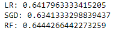

**[<-PREVIOUS PAGE]({{page.previous_}} "previous")** **[NEXT PAGE ->]({{page.next_}} "next")**   

In our previous exploration on player-specific models, we identified that each player is unique in terms of what variables indicate that they will have a strong hitting performance. For this reason, we trained separate Logistic Regression, SGD, and Random Forest models for each individual player with more than 30 samples in our original dataset (72% of players met this criteria). It should be noted that the parameters for the models were only tuned slightly, changing only parameters such as the solver for Logistic Regression and max iterations for Logistic Regression and SGD while other parameters such as the number of estimators for the Random Forest were kept at the default value. Other high-performing models such as Multilayer Perceptron and SVM were not used because they were too time intensive. 

The accuracy of the models were measured in precision because our goal is to predict when a player will get a hit, and we are more concerned with guessing incorrectly that they will get a hit as opposed to guessing incorrectly that they won't. However, it should be noted that our dataset is more positive heavy in the sense that 65% of the recorded data were hits as opposed to misses, so that can greatly affect our precision rate. We balance the dataset later, however, which helps to remedy this issue. The following were the results:

The average precision scores for the three models all hovered around 61-62%, which is about 1-2% lower than the precision scores for the general dataset, which hovered around 63-64%. One interesting thing to note is that Logistic Regression performed the best, then SGD, and finally Random Forest while the order was completely reversed for the general dataset. However, the difference between the models were less than 1%, so they are all very similar.

**[<-PREVIOUS PAGE]({{page.previous_}} "previous")** **[NEXT PAGE ->]({{page.next_}} "next")** 
