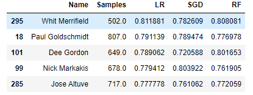
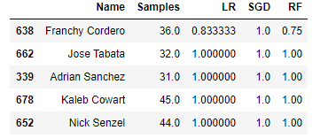
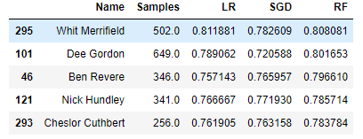
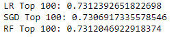

**[<-PREVIOUS PAGE]({{page.previous_}} "previous")** **[NEXT PAGE ->]({{page.next_}} "next")**   

In our previous exploration on player-specific models, we identified that each player is unique in terms of what variables indicate that they will have a strong hitting performance. For this reason, we trained separate Logistic Regression, SGD, and Random Forest models for each individual player with at least 200 samples in our original dataset (32% of players met this criteria). It should be noted that the parameters for the models were only tuned slightly, changing only parameters such as the solver for Logistic Regression and max iterations for Logistic Regression and SGD while other parameters such as the number of estimators for the Random Forest were kept at the default value. Other high-performing models such as Multilayer Perceptron and SVM were not used because they were too time intensive. 

The accuracy of the models were measured in precision because our goal is to predict when a player will get a hit, and we are more concerned with guessing incorrectly that they will get a hit as opposed to guessing incorrectly that they won't. However, it should be noted that our dataset is more positive heavy in the sense that 65% of the recorded data were hits as opposed to misses, so that can greatly affect our precision rate. We balance the dataset later, however, which helps to remedy this issue. The following were the results:

The average precision scores for the three models all hovered around 63-64%, which is about the same as the precision scores for the general dataset. The following were some of the most predictable players for each model. Some players were very predictable across all models, but there was also some variance in the most predictable players for each model:

Logistic Regression:

Stochastic Gradient Descent:

Random Forest:

When looking at the top 100 precision, we see a much better result with the models scoring around 73% precision:

Taking a look at one specific player who had 58 games recorded in our database, Carlos Correa, we see that all 3 models predicted his hitting with relatively well. This may be due to the fact that Carlos has had a very successful and consistent hitting career with a batting average of .295, making him more predictable than many other players.

Overall, the model was able to predict some players almost perfectly while others were a lot more difficult to predict. However, the player-specific models make certain players a lot more predictable.

**[<-PREVIOUS PAGE]({{page.previous_}} "previous")** **[NEXT PAGE ->]({{page.next_}} "next")** 
