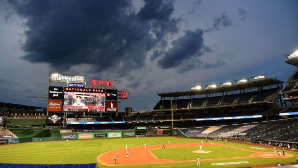

## Why Weather? **[NEXT PAGE ->](./blog1.html "next")**

We believe that external factors such as weather and wind can potentially impact a player's ability to hit the ball. One example would be the temperature where a player may be more fatigued on a hot day. The type of weather may also affect a player as some players may play significantly worse on a rainy day or signifcantly better on a cloudy day when the sun is not shining in their eyes. Wind can also affect a player's ability to hit the ball. For example, a pitch may come in faster or slower depending on the direction of the wind. For that reason, we not only measured the speed of the wind but also the direction. 

Overall, the four data fields that were collected and used for weather and wind data were the temperature in degrees, the category of weather, the wind speed in miles per hour, and the wind direction. We identified these four variables as the most important variables to capture the effects of the weather and wind during a game, and conducted analysis on whether these factors truly affected players. In the general dataset, the effect was not evident, but on a player by player basis we saw patterns in players' hitting ability during certain weather and wind conditions.

## Methodology and Sources

The weather and wind data were scraped off of mlb.com/scores using Python and the BeautifulSoup4 and Selenium libraries. The scraper parsed through each date within the 2014-2019 seasons and clicked on the box score of each regular season game (discludes training or exhibition games). Within the box score, multiple data fields were collected such as the date, the overall score of the game, the venue, and the weather and wind data. In total, the following 10 variables were collected for each game: Date, Team 1, Team 2, Team 1 Score, Team 2 Score, Venue, Weather (Degrees), Weather Type, Wind (MPH), and Wind Direction.
